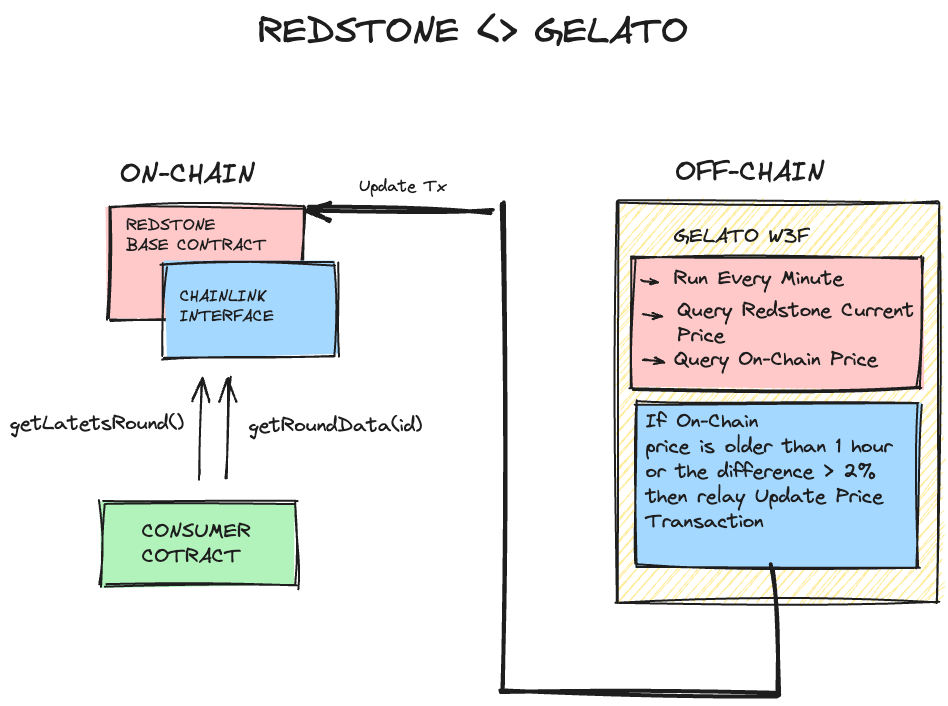

# unreal RedStone deployments


### Known Issues
Please, bear in mind that if the last block produced is older than one minute, the update wil fail with 'TimestampFromTooLongFuture' error

### How it works
  

  ## How to run the W3F

1. Install project dependencies:
```
yarn install
```

2. Create a `.env` file with your private config at the root folder:
```
cp .env.example .env
```
You will need to input your `PROVIDER_URLS`, your RPC.

At the W3F folder also:
```
cp .env.example .env
```
If you choose Relay as update method, you will need to input your `GELATO_API_KEY`for Relay, please visit [htts://app.gelato.netwoek](https://app.gelato.network/)

3. Test the  web3 function
```
npx w3f test web3-functions/redstone-interval/index.ts --logs --chain-id=YOUR CHAIN ID
```

4. Deploy the web3 function on IPFS
```
npx w3f deploy web3-functions/redstone-interval/index.ts
```
 ✓ Web3Function deployed to ipfs.
 ✓ CID: QmQYPZ6VGanbg1PoMmswYGTsQz3CXeBLvbXoXAfcFkFUYz

5. Create the task following the link provided when deploying the web3 to IPFS in our case:
```
> https://beta.app.gelato.network/new-task?cid=QmQYPZ6VGanbg1PoMmswYGTsQz3CXeBLvbXoXAfcFkFUYz
```
